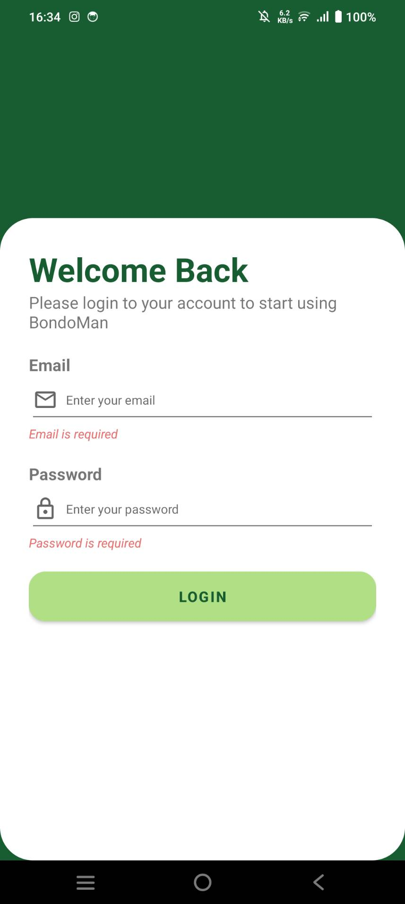
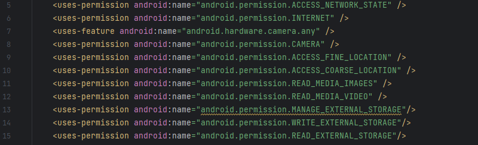
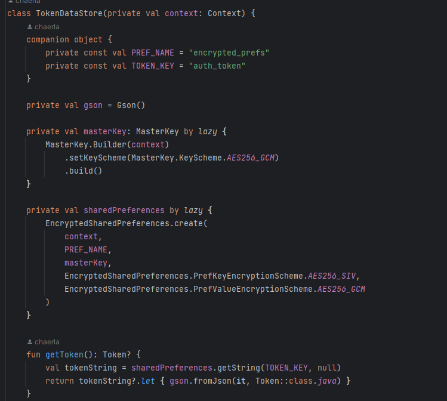
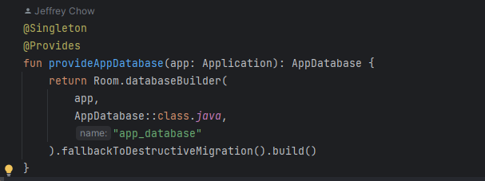
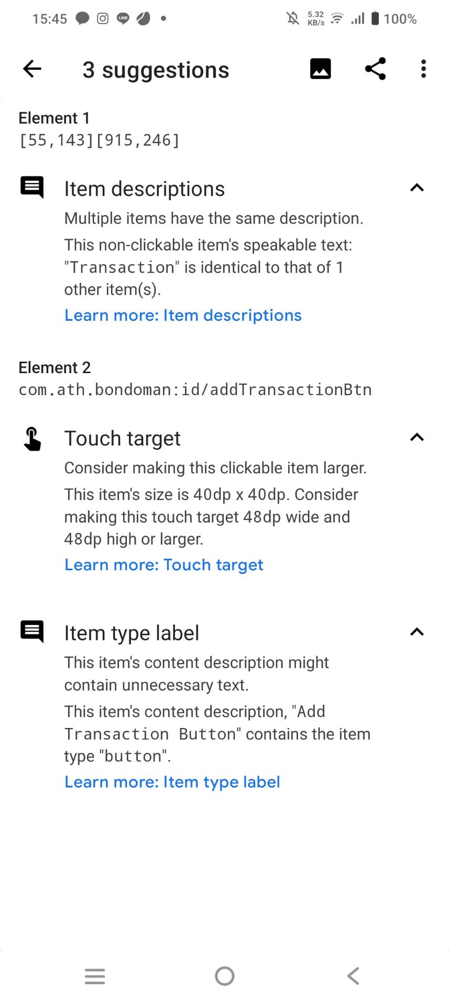
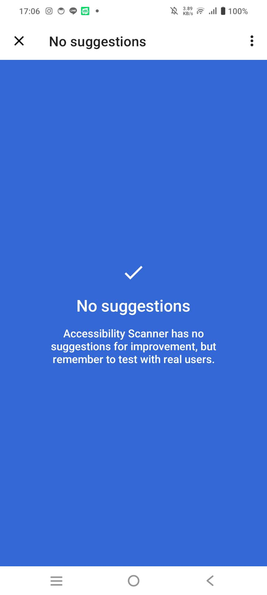
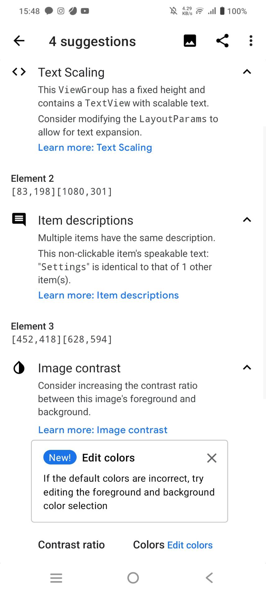
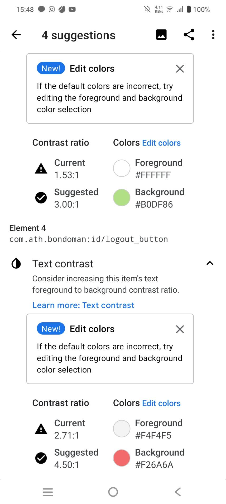
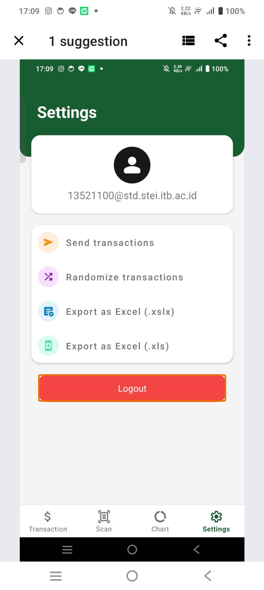
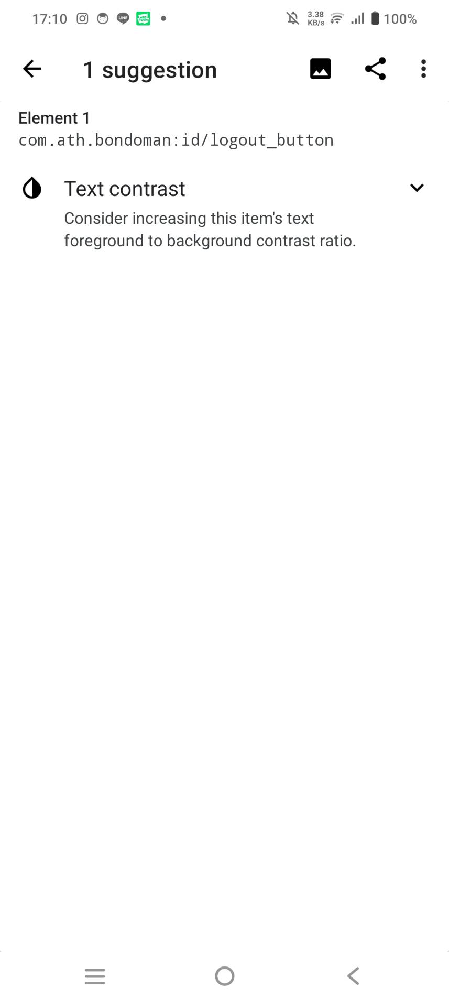

# BondoMan

BondoMan is an **Android Based Application** for _money management_ built using Kotlin, RoomDB, and Hilt Dependency Injection. This application is built to fulfill Tugas Besar Android for Platform Based Development IF3210 2023/2024. This app's minimum SDK version is Android API Level 29, with compile target Android API Level 34.

## Features

This app has a Login page to verify that only authenticated user can use the app.

This app is divided into 4 navigations:
**1. Transaction**
This page is for managing transactions. User can:

- See transaction list
- Add new transaction with information including transaction name, amount, current location, and category (income/expenditure)
- Edit and delete transsaction

**2. Scan**
This page is for scanning a bill. The bill is scanned from phone's camera and then the picture will be sent to a backend server to get the scan result. The scan result will be shown and the transaction will be added to transaction list.

**3. Graph**
This page is to visualize the proportion between expenditures and income.

**4. Settings**
This page provides additional features:

- Send transactions to export user's transactions and send them to the user's email
- Randomize transactions to insert random transaction
- Export transactions to .xlsx
- Export transsactions to .xls

**5. Twibbon**
This page is to create a twibbon for user's photo.

## Requirements

1. Android with minimum API SDK Level 29

## Screenshots

## Pembagian Tugas

**13521044**

- Setup repository and project
- Login page
- App navigation
- Background Service to Verify JWT
- Network Sensing
- OWASP

**13521046**

- Create, update, delete transaction (TransactionFromActivity)
- Transactions list (TransactionFragment)
- Randomize transaction (Broadcast Receiver)
- Accessibility Testing

**13521100**

- Scan & Upload Transaction (Scan Fragment)
- Add Scanned Item to Transaction List
- Chart Transaction (Chart Fragment)
- Export to xls and xlsx (Settings Fragment)
- Twibbon

## Bonus

### Twibbon
Here is how to use Twibbon feature in BondoMan:
1. Open the app and go to Twibbon menu
2. Choose the twibbon you want to use
3. Take a picture with the twibbon

### OWASP

_M4: Insufficient Input/Output Validation_

Insufficient input/output validation refers to the failure to properly validate and sanitize user inputs and outputs in an application.
For mitigation, BondoMan validations are user inputs:

1. On Login page, both email and password are validated.

2. On Add Transaction page, all fields are validated.

_M8: Security Misconfiguration_

Security misconfiguration refers to the improper configuration of security settings, permissions, or access controls in an application or its underlying infrastructure. It occurs when default settings are not changed, unnecessary services are enabled, or sensitive information is exposed, leading to potential security breaches and unauthorized access.
For mitigation, BondoMan:

1. Only requests for necessary permissions  
   

- ACCESS_NETWORK_STATE for Network Sensing and HTTPS requests
- INTERNET for Network Sensing and HTTPS requests
- camera and CAMERA for camera ussage
- ACCESS_FINE_LOCATION and ACCESS_COARSE_LOCATION for retrieving current location
- READ_MEDIA_IMAGES and READ_MEDIA_VIDEO for uploading library READ_MEDIA_IMAGES
- MANAGE_EXTERNAL_STORAGE and WRITE_EXTERNAL_STORAGE to store files on device's storage
- READ_INTERNAL_STORAGE to access files on device's storage

2. Only allows authenticated user to access the app's features and logs users out when JWT token expires.
3. Ensure encrypted communication with server through HTTPS with Retrofit.
4. Ensure each user can only access their own data and not other user's data
   _M9: Insecure Data Storage_

Insecure data storage refers to the improper handling and storage of sensitive data in an application. It occurs when sensitive information is stored in plaintext, improperly encrypted, or stored in insecure locations, making it vulnerable to unauthorized access or disclosure.

BondoMan mitigates this issue by:

1. Uses EncryptedSharedPreferences to store JWT token because it can't be accessed by other apps and it is encrypted.  
   
2. Uses RoomDB for secure data storing and access.  
   
3. Doesn't store sensitive data.

### Accessibility Testing

**Transaction Fragment**

#### Before

#### Changes

- Add description to Transaction header TextView
- Resize Add Transaction Button size to 40dp x 40dp
- Remove 'Button' word from Add Transaction Button description

#### After

**Settings Fragment**

#### Before

#### Changes

- Set height to 'wrap_content' instead of fixed size
- Set content description for Settings Header Title
- Change user image to black and white for contrast
- Change logout button background to 'red'

#### After

## Authors

|         Nama         |   NIM    |
| :------------------: | :------: |
| Rachel Gabriela Chen | 13521044 |
|     Jeffrey Chow     | 13521046 |
|   Alexander Jason    | 13521100 |
